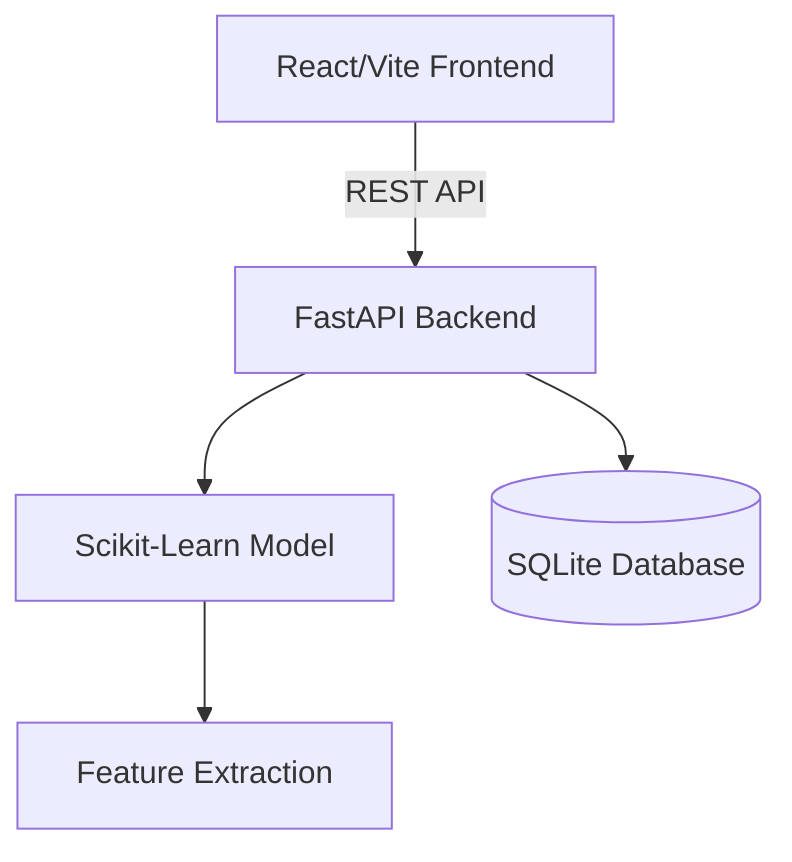

# PhishGuard - URL-Based Phishing Detection System

PhishGuard is a comprehensive, full-stack web application designed to detect phishing URLs in real-time. It uses a combination of heuristic rule-based checks and a trained Machine Learning model (Random Forest) to achieve high accuracy.

## Features

- **Real-time URL Scanning**: Instantly analyzes any URL.
- **Machine Learning Engine**: Uses a pre-trained Random Forest model evaluating 18 distinct URL features.
- **Heuristic Analysis**: Detects IP usage, suspicious keywords, excessive special characters, and shortening services.
- **Scan History**: Automatically logs all scans into a local SQLite database (easily configurable to PostgreSQL).
- **Beautiful Modern UI**: Built with React, Tailwind CSS, and Framer Motion, featuring a dark-mode cybersecurity aesthetic.
- **Interactive Dashboard**: View total scans, threats blocked, and detection rates via Recharts.

## Architecture



## Tech Stack

- **Frontend**: React 18, Vite, TypeScript, Tailwind CSS, Framer Motion, Recharts, Lucide-React.
- **Backend**: Python 3.9+, FastAPI, Uvicorn, SQLAlchemy.
- **Machine Learning**: Scikit-Learn (RandomForestClassifier), Pandas, NumPy, Joblib.

## Getting Started (Local Development)

### Prerequisites
- Node.js (v18+)
- Python (3.9+)

### 1. Backend Setup

```bash
cd backend
python -m venv venv
# Windows: venv\Scripts\activate
# Linux/Mac: source venv/bin/activate

pip install -r requirements.txt

# Train the initial ML model (generates model.joblib)
python ml/train.py

# Start the FastAPI server
uvicorn main:app --reload --port 8000
```
The API will be available at `http://localhost:8000`. API Docs available at `http://localhost:8000/docs`.

### 2. Frontend Setup

```bash
cd frontend
npm install
npm run dev
```
The frontend will be available at `http://localhost:5173`.

## Deployment (Docker)

To deploy the entire stack using Docker Compose:

```bash
docker-compose up --build -d
```
The frontend is accessible on port 80, and the backend on port 8000.

## Future Enhancements
- Integration with live threat intelligence feeds (e.g., PhishTank, VirusTotal).
- User Authentication (Clerk/Firebase).
- Automated daily model retraining.
